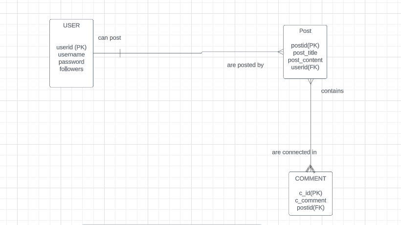

# Name :  Murali Krishna Chirumamilla
## Email ID : chmuralikrishna399@gmail.com

- I am Murali Krishna an international student from India. I have done my undergraduate in Electronics and Communication Engineering (ECE) and currently pursuing master’s in Computer Sciences at SUNY New Paltz. Back in my undergrad, I have taken few courses related to Computer Sciences like C language, Computer Networks and Cryptography. 

- I would be implementing a Social Media Platform almost similar to instagram(called FRIENDS) and below would be the rough ERD relationship diagram i have come up with.                                                                                                     

